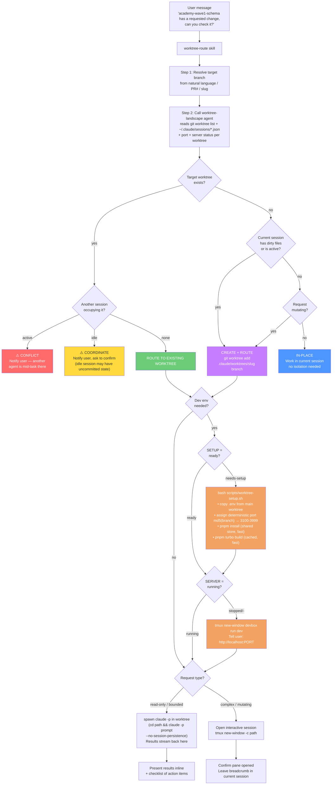

# worktree-route

A multi-agent aware git worktree router for Claude Code (OMP). Instead of interrupting your current work to check a branch, it figures out where the work belongs, ensures that worktree is ready to run, and handles it there — all from a single natural-language message.

---

## The problem

When you're deep in one branch and someone asks "can you check the academy-wave1-schema PR?", you have a few bad options: stop what you're doing and switch branches (losing context), or open a new terminal and manually set up the other branch (tedious). Neither works well when multiple AI agents are running simultaneously, because you also have to know which agent is where, whether that branch's dev server is running, and what port it's on.

This tool solves all of that. You say what you need, and it figures out the rest.

---

## How it works

Three pieces work together:

**1. `agents/worktree-landscape.md` — the eyes**

A lightweight haiku agent that reads the entire worktree situation on demand: every git worktree, its branch, dirty file count, assigned port, whether its dev server is currently listening, and whether any live Claude Code session is running inside it. This is the source of truth for every routing decision.

**2. `skill/SKILL.md` — the brain**

The routing skill that interprets your request, reads the landscape, and decides what to do. It resolves branch names from natural language (or PR numbers or slugs), checks whether isolation is needed, and picks the right execution path. It knows the difference between "check it" (read-only, spawn a subagent and report back) and "fix it" (mutating, open an interactive session).

**3. `scripts/worktree-setup.sh` — the hands**

An idempotent setup script that makes a fresh worktree ready to run. Because each worktree is its own directory, it needs its own `node_modules`, `.env`, and a port that won't collide with other running worktrees. This script handles all of that — and is fast because pnpm's content-addressable store is shared across all worktrees.

---

## Usage

Just describe what you want, naming the branch or PR:

```
academy-wave1-schema has a requested change, can you check it?
can you look at the fix/gce-3972 branch?
spin up the enrollment branch for me
rebase pr-7914 for me
```

The skill triggers whenever you name a branch that isn't your current one and want to do something with it. It doesn't trigger for questions about the current branch or pure git metadata reads like `git log`.

---

## Full decision flow



---

## Routing decisions explained

The skill asks three questions in sequence:

**1. Is a conflicting agent already there?**
It checks whether any live Claude Code session is running inside the target worktree. If one is actively processing a prompt, it stops and tells you — two agents writing to the same branch simultaneously will corrupt each other's work. If a session is there but idle, it warns you and asks to confirm (the idle session may have uncommitted state).

**2. Does a worktree for this branch already exist?**
If yes, it routes there directly regardless of what the current session is doing. Isolation is almost always worth it — keeping branches separate means you never accidentally commit changes from the wrong context.

If no worktree exists, it checks whether the current session has in-flight work (dirty files or active processing). If it does, it creates a new worktree. If the current session is clean and the request is read-only, it can just handle it in-place.

**3. Does the request need a running dev server?**
For code reviews and PR checks, no server is needed — the skill spawns a `claude -p` subprocess in the worktree and streams the result back. For UI work, E2E testing, or "spin it up" requests, it checks whether the worktree's server is running and starts it if not.

The full matrix:

| Worktree exists | Occupied by | Current session | Request type | Decision |
|---|---|---|---|---|
| yes | active agent | any | any | **CONFLICT** — stop |
| yes | idle agent | any | any | **COORDINATE** — confirm first |
| yes | nobody | any | any | **ROUTE THERE** |
| no | — | dirty / active | any | **CREATE + ROUTE** |
| no | — | clean | mutating | **CREATE + ROUTE** |
| no | — | clean | read-only | **IN-PLACE** |

---

## Dev environment setup

Each git worktree is an independent directory. It does not share `node_modules`, `.env`, or a port assignment with the main checkout. Running `devbox run dev` in a fresh worktree without setup will fail or collide with the main worktree's port.

`worktree-setup.sh` solves this idempotently. Run it once after creating a new worktree:

```bash
bash scripts/worktree-setup.sh
```

### What it does

**Copy `.env`** — The main worktree's `.env` holds dev secrets pulled from GCP. Copying it avoids the interactive `gcloud auth` flow that running `env:setup` from scratch requires. New worktrees get identical secrets instantly.

**Assign a deterministic port** — Each branch gets a port in the range 3100–3999, computed as `3100 + md5(branch_name) % 900`. The same branch always gets the same port across machines and restarts, so you never have to look it up. If the assigned port happens to be taken, it walks forward until it finds a free one. The result is written to two places:
  - `.devbox/worktree-port` — read by the landscape agent and `dev.sh`
  - `PORT=` in `.env.local` — tells `devbox run dev` where to start scanning

**Install dependencies** — `pnpm install` is fast here because pnpm uses a content-addressable store shared across all worktrees. Each worktree gets its own `node_modules` directory (required for tooling to work), but the actual package files are hard-linked from the shared store rather than copied. A second worktree for the same repo typically installs in seconds.

**Build shared packages** — `pnpm turbo build --filter='./packages/*'` compiles the 13 internal `@gcai/*` packages that Next.js and other apps import. Turbo's cache is also shared, so a warm-cache build takes ~10 seconds. A stamp file (`.devbox/last-pnpm-build`) records that this has been done.

### Port design

The main worktree always uses 3000 (the Next.js default). Worktrees set up via this script use 3100–3999. This separation means running the main checkout and any number of worktrees simultaneously won't collide, as long as each was set up with `worktree-setup.sh`.

`devbox run dev` also writes the port it selects back to `.devbox/worktree-port`. So whether a worktree was set up in advance by this script or started cold by `devbox run dev`, the landscape agent can always find its port by reading that file.

```
Main worktree     → port 3000   (always)
academy-wave1     → port 3421   (md5("academy-wave1-schema") % 900 + 3100)
fix/gce-3972      → port 3187   (md5("fix/gce-3972-multi-transcript") % 900 + 3100)
feature/foo       → port 3634   (md5("feature/foo") % 900 + 3100)
```

---

## Landscape agent output

Before every routing decision, the skill asks the `worktree-landscape` haiku agent for a snapshot. Here's what that looks like with dev env columns included:

```
Repo root: /Users/peter/code/app-gc-ai

Worktrees (4):
  TYPE  BRANCH                      DIRTY  PORT        SERVER   SETUP        SESSIONS
  main  gce-3514-enrollment-…       1      3000        running  ready        idle (pid=58017)
  wt    academy-wave1-schema         0      3421        stopped  ready        none
  wt    fix/gce-3972-multi-…        0      3187        stopped  ready        none
  wt    feature/new-dashboard        0      unassigned  -        needs-setup  none

Live sessions (1):
  pid=58017  cwd=/Users/peter/code/app-gc-ai  status=idle  sid=a1d9407e  worktree=main
```

**SETUP** tells the skill whether it needs to run `worktree-setup.sh` before the worktree is usable:
- `ready` — `.env` present, `node_modules` exists, packages built
- `needs-setup` — one or more of those missing; run the setup script
- `env-missing` — `.env` is absent; most urgent, nothing works without it

**SERVER** tells the skill whether there's a live dev server to point the user at:
- `running` — port is currently listening
- `stopped` — port assigned but nothing there
- `-` — port never assigned; server has never started in this worktree

---

## Execution patterns

### Read-only (results piped back to current session)

For code reviews, PR summaries, diff reads — anything that doesn't need to commit:

```bash
(cd <worktree_path> && claude -p "<prompt>" --no-session-persistence 2>&1)
```

The subagent runs in the worktree's directory with full access to that branch's files. Its output streams back into the current session, formatted under a `## Results from <branch> worktree` header with any action items as a checklist.

### Interactive (complex or mutating work)

For multi-step fixes, rebases, or anything that needs back-and-forth:

```bash
tmux new-window -c <worktree_path> "claude"
```

Opens a full Claude Code session in a new tmux window. The current session leaves a note about what was delegated.

### Dev server

For work that needs the app running:

```bash
tmux new-window -c <worktree_path> -n "<branch>" "devbox run dev"
# → http://localhost:<port>
```

---

## End-to-end example

**You type:** `academy-wave1-schema has a requested change, can you check it?`

**Step 1 — resolve:** The skill identifies `academy-wave1-schema` as the target branch.

**Step 2 — landscape:** The haiku agent reports that there's an existing worktree at `~/code/academy-wave1-schema`, it's clean (0 dirty files), no sessions are in it, its port is 3421, the server is stopped, and setup is ready.

Meanwhile, the current session is in the main worktree with 1 dirty file.

**Step 3 — route:** ROUTE TO EXISTING WORKTREE. The current session has in-flight work, so we don't touch it.

**Step 4 — dev env:** The request is a PR code review — no running server needed. Skip setup check.

**Step 5 — execute:** Spawns `claude -p` in `~/code/academy-wave1-schema` with a prompt to fetch the PR's review threads and summarize them.

**Result piped back:**

```
## Results from academy-wave1-schema worktree

PR #7931 — chore(db): add Zoom per-attendee registrant columns
State: OPEN · CHANGES_REQUESTED

Requested change (1 unresolved, Codex bot):
- packages/db/src/schema/academy.ts:263
  The pii_redaction_state check constraint covers email and name but not the
  new registrantId / registrantJoinUrl columns, which also hold PII.
  Add both to the constraint so the erasure invariant holds.

Recommendation: update the constraint, then run pnpm db:generate.
```

---

## Installation

1. Copy `agents/worktree-landscape.md` to `~/.claude/agents/` — this makes it available as a haiku subagent in any project.
2. Copy `skill/SKILL.md` to your project's `.agents/skills/worktree-route/SKILL.md`.
3. Copy `scripts/worktree-setup.sh` to your project's scripts directory and `chmod +x` it.
4. Add two lines to your `dev.sh` after port selection (see `scripts/dev-sh-patch.md`) to persist the selected port.

---

## Notes

**`.devbox/` is gitignored** — `worktree-port` and `last-pnpm-build` are machine-local state. They never get committed, which is correct — different machines may assign different ports if the base port is taken.

**Stale sessions are filtered** — `~/.claude/sessions/*.json` entries persist after a session ends. The landscape agent checks each PID with `kill -0` and silently skips any that aren't alive.

**Detached HEAD worktrees** work fine. `academy-wave1-schema` was created from a specific commit with no local branch name. The port hash falls back to the directory basename, which is stable.

**Port collisions are rare but handled** — with 900 slots and typically 3–5 active worktrees, collisions are unlikely. When they do occur, `worktree-setup.sh` walks forward from the hashed port until it finds a free one, then persists that actual port.
