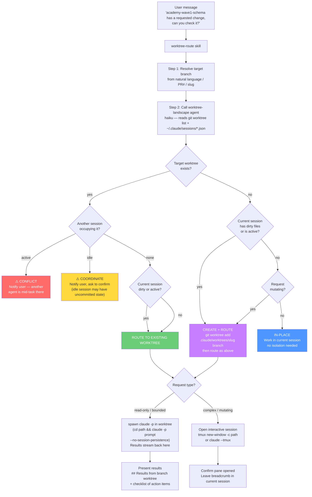

# worktree-route

Multi-agent aware git worktree router. When a message references a branch or PR by name, this skill reads the live session and worktree landscape, decides whether isolation is needed, and either routes the work into the right worktree or explains why it is safe to work in-place.

## Components

| File | Type | Purpose |
|------|------|---------|
| `SKILL.md` | Skill | Routing logic, decision matrix, execution patterns |
| `~/.claude/agents/worktree-landscape.md` | Haiku agent | Reads `git worktree list` + live `~/.claude/sessions/*.json` and returns a structured snapshot |

## Usage

Say anything that names a branch or PR you want to work on:

```
academy-wave1-schema has a requested change, can you check it?
can you look at the fix/gce-3972 branch?
rebase pr-7914 for me
```

The skill fires when the target is a **different branch** from the current one and the request involves modifying, checking, reviewing, or rebasing it.

## Decision flow



## Decision matrix

| `target_worktree` | `target_occupied` | `current_dirty / active` | Request type | Decision |
|-------------------|-------------------|--------------------------|--------------|----------|
| exists | active session | any | any | **CONFLICT** — stop, notify |
| exists | idle session | any | any | **COORDINATE** — notify, confirm |
| exists | none | yes | any | **ROUTE TO EXISTING** |
| exists | none | no | any | **ROUTE TO EXISTING** |
| missing | — | yes | any | **CREATE + ROUTE** |
| missing | — | no | mutating | **CREATE + ROUTE** |
| missing | — | no | read-only | **IN-PLACE** |

## Execution patterns

### Read-only check (results reported back)

```bash
(cd <worktree_path> && claude -p "<prompt>" --no-session-persistence 2>&1)
```

The subagent runs in the worktree's directory, has full access to that branch's files, and its output streams back into the current session.

### Complex / mutating work (interactive)

```bash
tmux new-window -c <worktree_path> "claude"
```

Opens a parallel interactive OMP session in the target worktree. The current session leaves a breadcrumb about what was delegated.

### New worktree creation

```bash
REPO_ROOT=$(git rev-parse --show-toplevel)
git worktree add "$REPO_ROOT/.claude/worktrees/<slug>" <branch>
```

Worktrees this skill creates follow the `.claude/worktrees/<slug>` convention inside the repo root, matching the existing layout.

## Landscape agent output

The `worktree-landscape` haiku agent produces output like this, which the skill reads to make its routing decision:

```
Repo root: /Users/peter/code/app-gc-ai

Worktrees (18):
  [main]  /Users/peter/code/app-gc-ai                        branch=gce-3514-enrollment-email-reminder  dirty=1  sessions=idle (pid=58017)
  [wt]    /Users/peter/code/academy-wave1-schema             branch=(detached)                          dirty=0  sessions=none
  [wt]    /Users/peter/code/app-gc-ai/.claude/worktrees/...  branch=cursor/fix-skill-editor-...         dirty=0  sessions=none

Live sessions (2):
  pid=58017  cwd=/Users/peter/code/app-gc-ai  status=idle  sid=a1d9407e  worktree=main
  pid=13519  cwd=/Users/peter/code/app-gc-ai  status=idle  sid=86908568  worktree=main
```

## Example end-to-end

**Input:** `academy-wave1-schema has a requested change, can you check it?`

1. Skill resolves target: `academy-wave1-schema` → worktree at `~/code/academy-wave1-schema`
2. Landscape agent reports: current session dirty=1, target worktree clean, no sessions there
3. Decision: **ROUTE TO EXISTING WORKTREE** (current has in-flight work)
4. Spawns `claude -p` in `~/code/academy-wave1-schema`
5. Subagent runs `gh pr list`, reads review threads, returns summary:

```
## Results from academy-wave1-schema worktree

PR #7931 — chore(db): add Zoom per-attendee registrant columns
State: OPEN · CHANGES_REQUESTED

Requested change (Codex bot, 1 unresolved):
- packages/db/src/schema/academy.ts:263
  The redaction-state check constraint doesn't cover registrantId / registrantJoinUrl.
  Add both columns so the PII erasure invariant holds.

Recommendation: add the two columns to the constraint, then pnpm db:generate.
```

## Notes

- Worktree re-use: the skill always checks for an existing worktree before creating a new one. Git rejects a second worktree for the same branch, and the skill surfaces that clearly.
- Stale sessions: `~/.claude/sessions/*.json` entries are filtered by live PID (`kill -0`) — dead sessions are ignored.
- Detached HEAD worktrees (e.g. `academy-wave1-schema`) are treated as normal worktrees; the detached state is noted to the user.
- The skill does not clean up worktrees after use. That is a deliberate choice — another session may continue the work.
