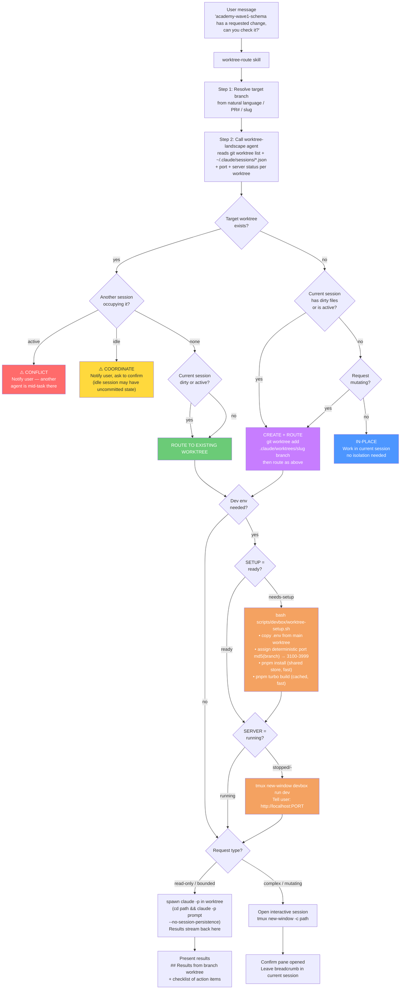

# worktree-route

Multi-agent aware git worktree router. When a message references a branch or PR by name, this skill reads the live session and worktree landscape, decides whether isolation is needed, ensures the dev environment is ready, and either routes the work into the right worktree or explains why it is safe to work in-place.

## Components

| File | Type | Purpose |
|------|------|---------|
| `skill/SKILL.md` | Skill | Routing logic, decision matrix, dev env setup, execution patterns |
| `agents/worktree-landscape.md` | Haiku agent | Reads `git worktree list` + live sessions + port/server status per worktree |
| `scripts/devbox/worktree-setup.sh` | Shell script | Idempotent fresh-worktree setup: copy env, assign port, install deps, build packages |

The landscape agent and setup script live in the main repo. The skill and haiku agent files in this repo are the standalone/distributable versions.

## Usage

Say anything that names a branch or PR you want to work on:

```
academy-wave1-schema has a requested change, can you check it?
can you look at the fix/gce-3972 branch?
spin up the enrollment branch for me
rebase pr-7914 for me
```

The skill fires when the target is a **different branch** from the current one and the request involves modifying, checking, reviewing, running, or rebasing it.

## Full decision flow



## Routing decision matrix

| `target_worktree` | `target_occupied` | `current_dirty/active` | Request | Decision |
|---|---|---|---|---|
| exists | active session | any | any | **CONFLICT** — stop, notify |
| exists | idle session | any | any | **COORDINATE** — notify, confirm |
| exists | none | yes | any | **ROUTE TO EXISTING** |
| exists | none | no | any | **ROUTE TO EXISTING** |
| missing | — | yes | any | **CREATE + ROUTE** |
| missing | — | no | mutating | **CREATE + ROUTE** |
| missing | — | no | read-only | **IN-PLACE** |

## Dev environment setup

Each worktree is its own directory — it needs its own `node_modules`, `.env`, and an assigned port before `devbox run dev` will work.

### `worktree-setup.sh`

Idempotent. Run once after `git worktree add`:

```bash
bash scripts/devbox/worktree-setup.sh
# or from outside the worktree:
(cd .claude/worktrees/<slug> && bash scripts/devbox/worktree-setup.sh)
```

What it does:

1. **Copy `.env`** from the main worktree — avoids the interactive `gcloud auth` prompt that `env:setup` requires
2. **Assign a deterministic port** — `3100 + md5(branch_name) % 900` — consistent across machines and restarts. Walks forward if the hashed port is already taken.
3. **Write port** to `.devbox/worktree-port` and `PORT=` in `.env.local` so `dev.sh` picks it up
4. **`pnpm install`** — fast because pnpm's content-addressable store is shared across worktrees (symlinks, not copies)
5. **`pnpm turbo build --filter='./packages/*'`** — fast on warm Turbo cache (~10s)

### Port assignment

| Worktree | Port |
|----------|------|
| Main (`app-gc-ai`) | 3000 (default) |
| Any worktree after setup | 3100–3999 (md5 hash of branch name) |
| Worktree started without setup | scans from 3000 — may conflict with main |

Multiple worktrees can run simultaneously without collision as long as each was set up via `worktree-setup.sh` or started via `devbox run dev` (which increments past taken ports and writes the result back to `.devbox/worktree-port`).

### What `devbox run dev` does with a pre-assigned port

`dev.sh`'s `find_free_port` starts scanning from `${PORT:-3000}`. Because `worktree-setup.sh` wrote `PORT=<assigned>` into `.env.local`, the scan starts at the pre-assigned port rather than 3000, so it lands there immediately (unless something else grabbed it in the meantime). The final selected port is written back to `.devbox/worktree-port`.

### Landscape agent output (with dev env columns)

```
Repo root: /Users/peter/code/app-gc-ai

Worktrees (3):
  TYPE  BRANCH                      DIRTY  PORT   SERVER   SETUP        SESSIONS
  main  gce-3514-enrollment-…       1      3000   running  ready        idle (pid=58017)
  wt    academy-wave1-schema         0      3421   stopped  ready        none
  wt    fix/gce-3972-multi-…        0      unassigned  -   needs-setup  none

Live sessions (1):
  pid=58017  cwd=/Users/peter/code/app-gc-ai  status=idle  sid=a1d9407e  worktree=main
```

## Execution patterns

### Read-only check (results reported back)

```bash
(cd <worktree_path> && claude -p "<prompt>" --no-session-persistence 2>&1)
```

### Complex / mutating work (interactive)

```bash
tmux new-window -c <worktree_path> "claude"
```

### Dev server (in a named tmux window)

```bash
tmux new-window -c <worktree_path> -n "<branch>" "devbox run dev"
# Dev server URL: http://localhost:<port>
```

## Example end-to-end

**Input:** `academy-wave1-schema has a requested change, can you check it?`

1. Skill resolves target: `academy-wave1-schema` → worktree at `~/code/academy-wave1-schema`
2. Landscape agent reports: current dirty=1, target clean, no sessions, port=3421, server=stopped, setup=ready
3. Decision: **ROUTE TO EXISTING WORKTREE** (current has in-flight work)
4. Request is read-only (check PR) → no dev server needed
5. Spawns `claude -p` in `~/code/academy-wave1-schema`
6. Returns:

```
## Results from academy-wave1-schema worktree

PR #7931 — chore(db): add Zoom per-attendee registrant columns
State: OPEN · CHANGES_REQUESTED

Requested change (Codex bot, 1 unresolved):
- packages/db/src/schema/academy.ts:263
  The redaction-state check constraint doesn't cover registrantId / registrantJoinUrl.
  Add both columns so the PII erasure invariant holds.

Recommendation: add the two columns to the constraint, then pnpm db:generate.
```

## Notes

- **`.devbox/` is gitignored** — `worktree-port` and `last-pnpm-build` are local state, never committed
- **pnpm shared store** — `pnpm install` across worktrees deduplicates package content via hard links; each worktree gets its own `node_modules` symlink tree but shares the underlying files
- **Detached HEAD worktrees** (like `academy-wave1-schema` which was created from a specific commit) are treated normally; branch name falls back to the directory basename for port hashing
- **Stale sessions** in `~/.claude/sessions/` are filtered by live PID (`kill -0`) — dead entries are ignored
- **Port collision** between two worktrees is prevented by the deterministic hash spreading assignments across 3100–3999; actual collisions are resolved at runtime by walking forward
